# ✨ Hi, I'm Nova

**Systems-minded builder working across infrastructure, Kubernetes, observability, networking, security, local AI, and automation.**

19 years in manufacturing systems 🏭 → building and operating **NovaLabs**, my self-hosted infrastructure and engineering lab.
Ontario, Canada 🍁

> **Philosophy:** I feel more comfortable driving my car when I understand how the brakes work.

---

## 🧪 NovaLabs

**NovaLabs is my living systems lab.**

It spans traditional infrastructure, networking, Kubernetes, observability, data engineering, local AI inference, automation, developer environments, security research, and experimental AI systems.

I use it to learn technologies by actually operating them: deploying workloads, breaking things, recovering them, instrumenting them, documenting them, and turning what worked into repeatable infrastructure.

| Domain                           | Current Environment                                                           |
| -------------------------------- | ----------------------------------------------------------------------------- |
| 🖥️ **Compute & Virtualization** | Proxmox VE 9 · NVIDIA DGX Spark · Raspberry Pi 5 · Debian · Ubuntu            |
| ☸️ **Container Platform**        | k3s · Kubernetes · Flux GitOps · Docker · containerd                          |
| 🧠 **Local AI**                  | NVIDIA GB10 · vLLM · LiteLLM · Hermes Agent · Ollama · Hugging Face · ComfyUI |
| 🎧 **Audio & Multimodal AI**     | Whisper · diarization · TTS · screen vision · persistent AI memory            |
| 📊 **Observability**             | Prometheus · Grafana · Loki · Alertmanager · Alloy · Telegraf · TimescaleDB   |
| 🌐 **Networking**                | OPNsense · VLANs · Pi-hole · Unbound · Traefik · Cloudflare Tunnel            |
| 🛡️ **Security**                 | Suricata · Twingate · SOPS + age · CVE tracking · network segmentation        |
| 🔧 **Platform Engineering**      | Forgejo · GitHub · Renovate · ChezMoi · Mise · systemd                        |
| 💾 **Data**                      | PostgreSQL · TimescaleDB · pgAdmin · persistent Kubernetes storage            |

---

# 🚀 What I'm Building

## ☸️ [Lovelace Cluster](https://github.com/calico88x/lovelace-cluster)

A heterogeneous **k3s cluster operated declaratively with Flux**.

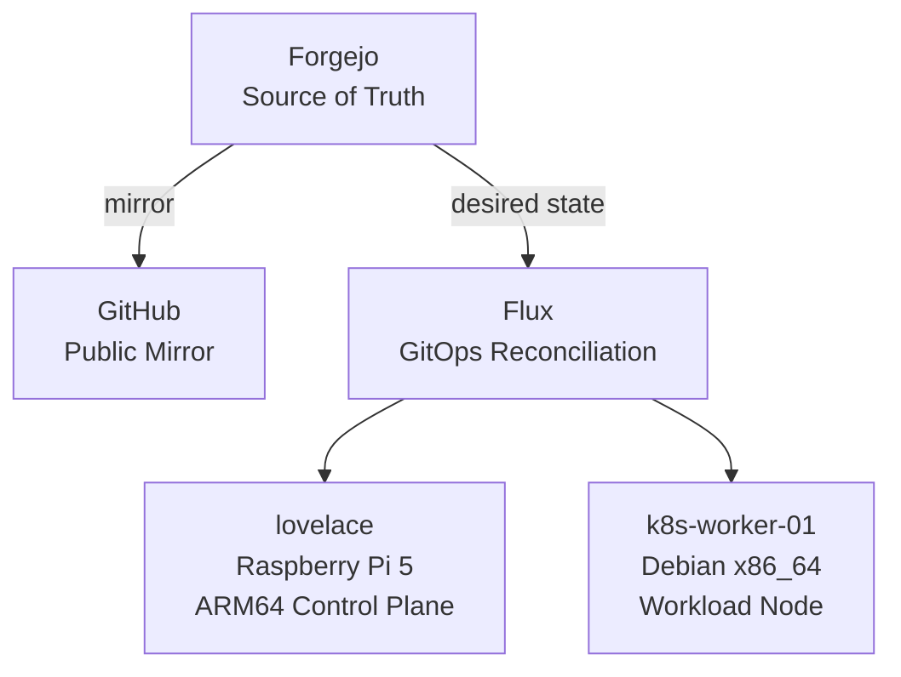

Current platform features include:

* Raspberry Pi 5 ARM64 control plane
* Debian x86_64 workload node
* Forgejo as the primary Git service
* GitHub as an external public mirror
* Flux reconciliation from `main`
* Kustomize base + environment overlays
* SOPS + age encrypted Kubernetes secrets
* Traefik ingress
* persistent local storage
* node-bound workloads where appropriate
* Renovate dependency automation
* Prometheus-based observability
* Grafana dashboards
* centralized log collection with Alloy and Loki
* externally exposed applications through purpose-specific tunnels

The rule is simple:

> **Git is desired state. Kubernetes is current state.**

---

## ⚙️ Minecraft — All of Create

One of the largest stateful workloads running on Lovelace is a dedicated **modded Minecraft Create server**.

Rather than treating it like a manually managed game server, I built it as an actual Kubernetes application.

### Platform

* **Minecraft 1.21.1**
* **NeoForge**
* **All of Create**
* dedicated Kubernetes namespace
* StatefulSet deployment
* dedicated x86_64 worker scheduling
* 8-vCPU worker capacity for faster JVM and modpack startup
* separate lifecycle from my Paper Minecraft environment

### GitOps Delivery

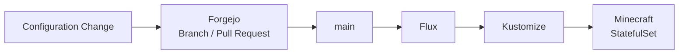

The deployment includes:

* reusable Kustomize base
* cluster-specific staging overlay
* Flux-controlled reconciliation
* Forgejo as source of truth
* GitHub mirror
* encrypted configuration using SOPS + age
* Git-controlled server configuration
* declarative workload scheduling

### Persistent World Storage

Minecraft world data lives on dedicated persistent storage attached to the Kubernetes worker.

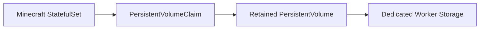

The design includes:

* dedicated host storage
* static persistent volume
* persistent volume claim
* retained world data across pod recreation
* node affinity to keep storage and workload together
* Kubernetes-safe handling of stateful data

The server can be destroyed and recreated without treating the Minecraft world itself as ephemeral container state.

### External Access

Player traffic is exposed through a dedicated **Playit tunnel** rather than directly opening the game server to the Internet.

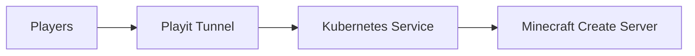

Tunnel credentials remain encrypted in Git.

### Observability

The server is integrated into the wider NovaLabs monitoring stack.

I can observe:

* Minecraft service availability
* JVM / server metrics
* worker CPU and memory
* filesystem capacity
* storage utilization
* network activity
* node health
* public tunnel reachability

Logs are collected through **Grafana Alloy → Loki** and explored alongside infrastructure metrics in Grafana.

Minecraft telemetry is also included in the durable NovaLabs telemetry pipeline for historical analysis.

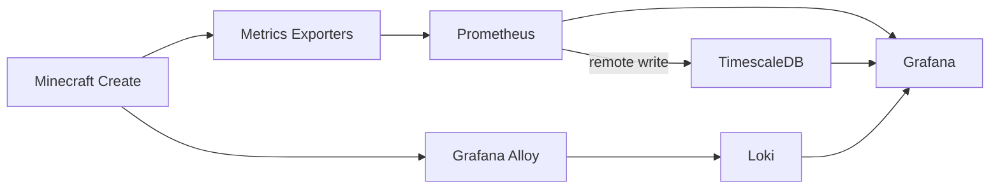

It is, perhaps unnecessarily, a **GitOps-operated, observable, stateful distributed-systems exercise disguised as Minecraft**.

And that is precisely why I built it.

---

## ⚡ [DGX Model Manager](https://github.com/calico88x/DGX-Model-Manager)

A **Compose-first model operations control plane for NVIDIA DGX Spark**.

Built to manage the operational side of local AI infrastructure:

* Hugging Face model inventory
* local model metadata inspection
* Ollama model discovery and management
* Hugging Face model search and downloads
* DGX-aware deployment planning
* vLLM deployment workflows
* SGLang deployment workflows
* llama.cpp support
* Docker Compose lifecycle management
* serving-engine discovery
* LiteLLM routing
* host and service diagnostics
* authentication
* role-based access
* API tokens
* audit logging
* multi-node DGX Spark architecture

The primary development target is an:

**NVIDIA DGX Spark · GB10 Grace Blackwell · 128 GB unified memory**

The goal is to treat local models like actual infrastructure rather than a collection of shell scripts.

---

## 🧰 [NovaLabs Dotfiles](https://github.com/calico88x/novalabs-dotfiles)

A centralized configuration and userland management system for the NovaLabs fleet using **ChezMoi + Mise**.

The architecture deliberately separates ownership:

| Layer                | Owner                |
| -------------------- | -------------------- |
| User configuration   | ChezMoi              |
| Portable CLI tooling | Mise                 |
| System components    | OS / platform vendor |

Current profiles cover:

`Proxmox` · `Docker` · `Pi-hole` · `UbuntuLab` · `Lovelace` · `k8s-worker-01` · `DGX Spark` · `OPNsense`

The repository manages:

* Bash environment
* Neovim + LazyVim
* pinned plugin state
* Tree-sitter tooling
* Rust toolchain
* Starship
* Fastfetch
* btop
* LazyGit
* LazyDocker
* tmux
* Vim
* Git configuration
* portable CLI utilities

Each server retains its own visual identity through generated:

* host-colored Starship prompts
* Fastfetch configurations
* btop themes

The repository is maintained primarily in **Forgejo**, with GitHub serving as the public mirror.

---

# 📊 Observation & Intelligence

A significant part of NovaLabs is not simply running services.

It is building the instrumentation required to **understand what those systems are actually doing**.

---

## 🤖 AI Inference Operations Dashboard

My DGX Spark is shared by several different inference consumers:

* my own interactive AI workloads
* Yuki / Hermes
* applications
* background services
* friends using private inference access

I built a Grafana dashboard specifically to see that shared inference pipeline as an operational system.

### Serving Layer

The dashboard observes:

* vLLM availability
* LiteLLM availability
* running requests
* waiting requests
* completed requests
* request success rate
* scheduler concurrency

### GPU & Memory

Because the GB10 uses a unified-memory architecture, memory behavior is particularly important.

I monitor:

* GPU utilization
* GPU temperature
* unified memory usage
* model-serving memory pressure
* KV-cache utilization

### Inference Performance

The dashboard exposes:

* token throughput
* prompt activity
* generation activity
* latency
* request volume
* model activity

### Multi-user Visibility

LiteLLM gives me visibility above the raw inference-engine layer.

That means I can distinguish traffic generated by different consumers rather than merely seeing:

> GPU busy.

I can observe inference usage associated with individual users and services, including separate Hermes activity.

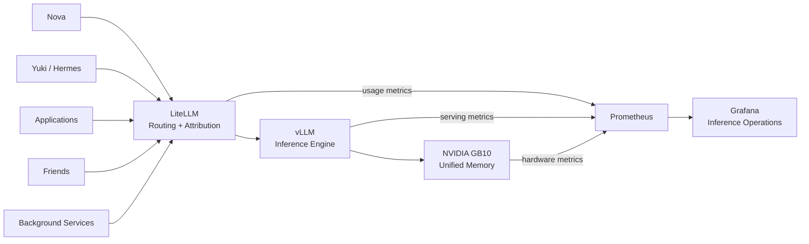

The result is an operational view of **who is using the inference platform, what the serving engine is doing, and what that workload is doing to the hardware**.

---

## 📺 TV Tuner & Streaming Observation

I built a dedicated observation layer around my **over-the-air TV streaming environment** while troubleshooting live-TV reliability problems with Plex and later migrating the workload to Jellyfin.

The tuner itself is an **HDHomeRun**, but the interesting part of the project became understanding the entire path a television stream takes through the lab.

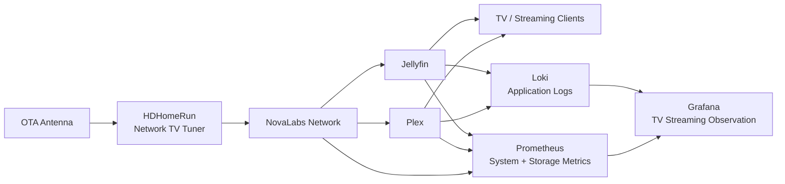

The project started because intermittent TV-streaming problems are difficult to diagnose from the player alone.

A stalled or degraded live stream could originate from several different layers:

* tuner reception
* network transport
* media-server behavior
* transcoding
* storage
* CPU or memory pressure
* client playback
* application instability

The observation environment lets me correlate streaming problems with the rest of the system instead of treating every playback failure as a generic Plex or Jellyfin problem.

I can examine things such as:

* media-server availability
* host CPU and memory
* filesystem capacity
* storage utilization
* network activity
* container health
* application logs
* tuner-related infrastructure
* transcoding behavior
* events occurring at the same time as a playback problem

This became particularly useful during my migration from **Plex to Jellyfin**, where I could compare behavior while changing the media-serving layer without changing the tuner or underlying network.

The result is less:

> *“The TV froze again.”*

and more:

> **“What changed in the system at the exact moment the stream failed?”**

That distinction is a recurring theme throughout NovaLabs: if a problem is intermittent, make it observable.

---

## 🕐 NovaLabs Time Service

Accurate time is one of those infrastructure dependencies that is almost invisible until it goes wrong.

I built a dedicated **time synchronization service and Grafana observation dashboard** to understand how clocks across NovaLabs behave rather than relying solely on a binary `synchronized: yes` status.

The system tracks time synchronization as measurable infrastructure.

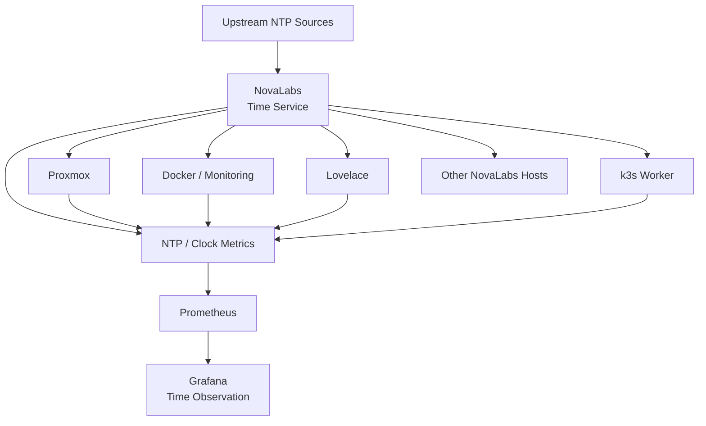

The dashboard focuses on questions that ordinary system status commands do not answer very well:

* **Are the hosts synchronized?**
* **Which time source is currently being selected?**
* **What stratum am I operating at?**
* **How far is the local clock from its reference?**
* **How much correction is being applied?**
* **Is clock offset stable over time?**
* **Did synchronization behavior change after moving to another source?**

One of the most interesting measurements is the **observed clock offset**.

Rather than simply seeing that synchronization is active, I can watch the clock continuously move around its reference at microsecond-scale resolution and see how that behavior changes when the selected time source changes.

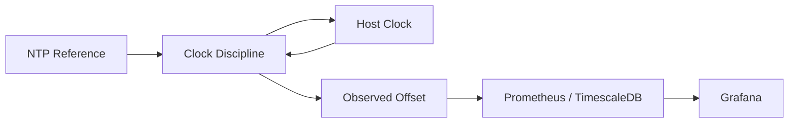

This turns NTP from a background daemon into another observable distributed system.

The goal is not extreme precision for its own sake. It is to ensure that every system generating:

* metrics
* logs
* alerts
* database records
* Kubernetes events
* security events

has a trustworthy concept of **when something actually happened**.

That becomes increasingly important as NovaLabs grows into a distributed environment where events from many independent machines need to line up on the same timeline.

---

## 🛡️ CVE Tracker

Security work in NovaLabs includes a dedicated **CVE tracking dashboard**.

I use it to maintain visibility into vulnerabilities relevant to systems I actually operate rather than relying solely on generic vulnerability news.

The broader workflow includes:

* vulnerability tracking
* affected-system investigation
* CVE research
* remediation status
* patch documentation
* historical notes on vulnerabilities that were actually addressed

This is evolving into a broader **cyber intelligence pipeline** built around authoritative structured sources.

Current source work includes:

* CISA KEV
* FIRST EPSS
* ENISA EUVD
* ThreatFox
* privacy and regulatory intelligence sources

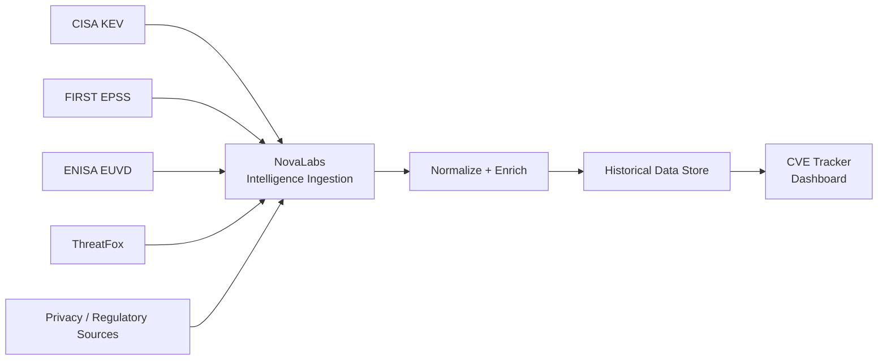

The long-term architecture separates vulnerability intelligence, exploitation likelihood, known-active exploitation, and privacy / sovereignty events while retaining historical state for analysis.

---

## 📈 NovaLabs Telemetry Warehouse

Live monitoring and historical telemetry serve different purposes.

So NovaLabs uses both.

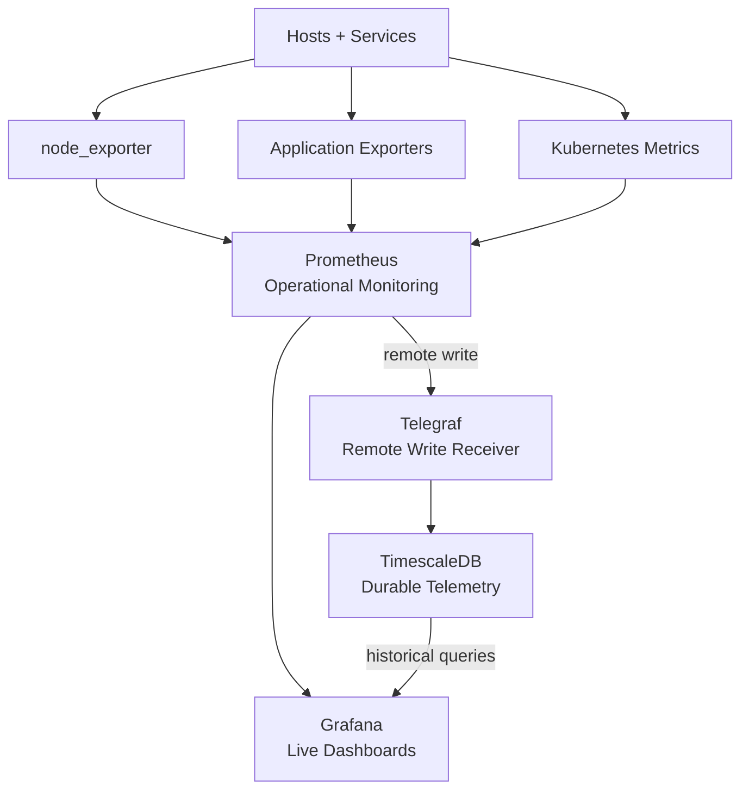

Prometheus remains the live operational monitoring system.

TimescaleDB provides durable historical telemetry for:

* host health
* virtualization
* storage
* network behavior
* containers
* Minecraft
* infrastructure availability
* telemetry warehouse health

This allows Grafana to move beyond short retention windows and answer longer-term questions about how the lab behaves.

---

# 🧠 AI Systems

## 🐾 Yuki

Yuki is my locally hosted AI agent environment.

She runs through a private stack built around:

* Hermes Agent
* LiteLLM
* vLLM
* local speech services
* tools
* persistent memory
* local inference on DGX Spark

The larger goal is not simply to run an LLM locally.

It is to understand how to operate an **AI system**.

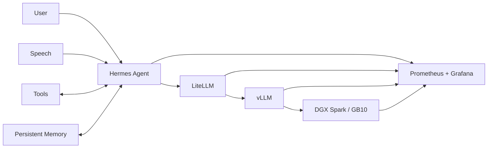

---

## 🎧 Many Ears

**Many Ears** extends Yuki beyond conversational text and gives her a pipeline for listening to and processing audio.

The project grew from a simple idea:

> What would an AI system need in order to actually listen?

The pipeline handles audio as something that can be processed, analyzed, and understood rather than simply played back.

Current work includes:

* audio ingestion
* music listening
* audio processing
* speech transcription
* speaker diarization
* processing longer recordings
* producing structured information that downstream AI systems can use

The architecture separates listening from reasoning.

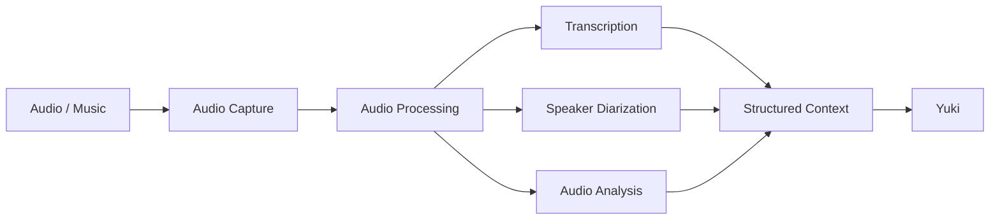

The important distinction is that Yuki does not need to perform every expensive audio operation inside the conversational model itself.

**Many Ears acts as the perception layer.**

---

## 👁️ [DGX Eyes and Ears](https://github.com/calico88x/DGX-Eyes-and-Ears)

A separate multimodal experiment exploring an AI that can share the user's visual and auditory environment.

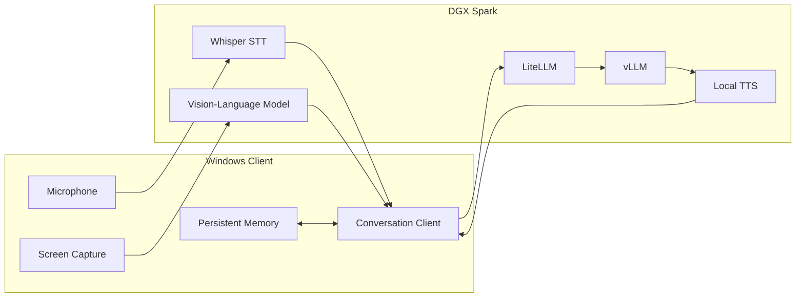

The client combines:

* microphone input
* screen capture
* speech recognition
* visual context
* conversational inference
* persistent memory
* local text-to-speech

The project explores what locally hosted conversational AI looks like when it can perceive the same environment as the person using it.

---

# 🛠️ Technology Domains

## ☸️ Platform, Containers & GitOps

## 🧠 AI & Inference

## 🎧 Audio & Multimodal AI

## 📊 Observability & Telemetry

## 🌐 Networking & Security

## 🔧 DevOps & Source Control

## 💻 Systems & Development

---

# 🔬 Current Focus

Right now I'm particularly interested in:

* **GitOps and Kubernetes platform engineering**
* **durable observability and telemetry architecture**
* **Grafana as an investigative interface rather than just a status screen**
* **local AI inference infrastructure**
* **multi-user AI serving**
* **AI observability and inference economics**
* **audio and multimodal AI perception**
* **cyber vulnerability intelligence**
* **Linux systems engineering**
* **networking and CCNA fundamentals**
* **security, segmentation, and infrastructure hardening**
* **self-hosted developer platforms**
* **reproducible workstation and server environments**
* **stateful workloads on Kubernetes**
* **turning manual operations into documented, version-controlled systems**

---

# 💡 How I Work

My background is in manufacturing systems, where reliability is not theoretical: equipment has to run, problems need root causes, and fixes need to survive the next shift.

I bring the same mindset to infrastructure.

**Inspect before changing.
Understand ownership boundaries.
Make the desired state explicit.
Automate the repeatable parts.
Instrument the system.
Observe what actually happened.
Document what you learned.**

Most of my projects start with:

> *“I want to understand how this works.”*

Eventually that tends to become a:

`repository` · `dashboard` · `runbook` · `service` · `pipeline` · `automation`

I don't want the lab to hide complexity from me.

I want it to make complexity **observable, explainable, and manageable**.

---

# 📚 Learning in Public

NovaLabs is intentionally a learning environment.

I use real infrastructure to explore:

* Kubernetes architecture and operations
* GitOps workflows
* routing and switching
* VLANs
* OSPF
* Linux administration
* PostgreSQL and time-series systems
* monitoring and telemetry
* infrastructure security
* vulnerability intelligence
* backend development
* containerization
* local AI systems
* inference serving
* multimodal AI
* audio processing

The repositories here aren't meant to present a magically finished environment.

They're a record of systems being:

**designed → deployed → observed → broken → understood → improved**

---

# 📬 Reach Me

* **GitHub:** [calico88x](https://github.com/calico88x)
* **Portfolio:** [NovaLabs](https://novalabs88.tech)
* **LinkedIn:** [Nova Peck](https://www.linkedin.com/in/nova-peck/)
* **Telegram:** [@nova88x](https://t.me/nova88x)
* **X:** [@xCalico88x](https://x.com/xCalico88x)

---

> *“Learn to manage AI, or AI will learn to manage you.”*
